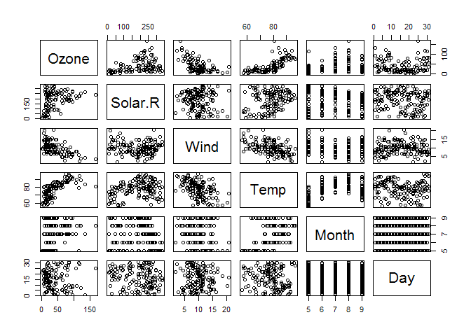

# RMarkdown demonstration
Damon Resnick  
December 31, 2016  


RMarkdown demonstration
=======================

Demo RMarkdown file.

Let's load some data.


```r
library(datasets)
data(airquality)
summary(airquality)
```

```
##      Ozone           Solar.R           Wind             Temp      
##  Min.   :  1.00   Min.   :  7.0   Min.   : 1.700   Min.   :56.00  
##  1st Qu.: 18.00   1st Qu.:115.8   1st Qu.: 7.400   1st Qu.:72.00  
##  Median : 31.50   Median :205.0   Median : 9.700   Median :79.00  
##  Mean   : 42.13   Mean   :185.9   Mean   : 9.958   Mean   :77.88  
##  3rd Qu.: 63.25   3rd Qu.:258.8   3rd Qu.:11.500   3rd Qu.:85.00  
##  Max.   :168.00   Max.   :334.0   Max.   :20.700   Max.   :97.00  
##  NA's   :37       NA's   :7                                       
##      Month            Day      
##  Min.   :5.000   Min.   : 1.0  
##  1st Qu.:6.000   1st Qu.: 8.0  
##  Median :7.000   Median :16.0  
##  Mean   :6.993   Mean   :15.8  
##  3rd Qu.:8.000   3rd Qu.:23.0  
##  Max.   :9.000   Max.   :31.0  
## 
```

Let's first make a pairs plot


```r
pairs(airquality)
```

<!-- -->

Here's a regression model of ozone on wind, solar radiation, and temperature.


```r
library(stats)
fit <- lm(Ozone ~ Wind + Solar.R + Temp, data = airquality)
fit
```

```
## 
## Call:
## lm(formula = Ozone ~ Wind + Solar.R + Temp, data = airquality)
## 
## Coefficients:
## (Intercept)         Wind      Solar.R         Temp  
##   -64.34208     -3.33359      0.05982      1.65209
```

```r
summary(fit)
```

```
## 
## Call:
## lm(formula = Ozone ~ Wind + Solar.R + Temp, data = airquality)
## 
## Residuals:
##     Min      1Q  Median      3Q     Max 
## -40.485 -14.219  -3.551  10.097  95.619 
## 
## Coefficients:
##              Estimate Std. Error t value Pr(>|t|)    
## (Intercept) -64.34208   23.05472  -2.791  0.00623 ** 
## Wind         -3.33359    0.65441  -5.094 1.52e-06 ***
## Solar.R       0.05982    0.02319   2.580  0.01124 *  
## Temp          1.65209    0.25353   6.516 2.42e-09 ***
## ---
## Signif. codes:  0 '***' 0.001 '**' 0.01 '*' 0.05 '.' 0.1 ' ' 1
## 
## Residual standard error: 21.18 on 107 degrees of freedom
##   (42 observations deleted due to missingness)
## Multiple R-squared:  0.6059,	Adjusted R-squared:  0.5948 
## F-statistic: 54.83 on 3 and 107 DF,  p-value: < 2.2e-16
```

This doesn't work quite right. Hmmm...


```r
library(xtable)
xt <- xtable(summary(fit))
print(xt, type = "html")
```

<!-- html table generated in R 3.3.2 by xtable 1.8-2 package -->
<!-- Sat Dec 31 11:28:24 2016 -->
<table border=1>
<tr> <th>  </th> <th> Estimate </th> <th> Std. Error </th> <th> t value </th> <th> Pr(&gt;|t|) </th>  </tr>
  <tr> <td align="right"> (Intercept) </td> <td align="right"> -64.3421 </td> <td align="right"> 23.0547 </td> <td align="right"> -2.79 </td> <td align="right"> 0.0062 </td> </tr>
  <tr> <td align="right"> Wind </td> <td align="right"> -3.3336 </td> <td align="right"> 0.6544 </td> <td align="right"> -5.09 </td> <td align="right"> 0.0000 </td> </tr>
  <tr> <td align="right"> Solar.R </td> <td align="right"> 0.0598 </td> <td align="right"> 0.0232 </td> <td align="right"> 2.58 </td> <td align="right"> 0.0112 </td> </tr>
  <tr> <td align="right"> Temp </td> <td align="right"> 1.6521 </td> <td align="right"> 0.2535 </td> <td align="right"> 6.52 </td> <td align="right"> 0.0000 </td> </tr>
   </table>

```r
library(texreg)
```

```
## Version:  1.36.18
## Date:     2016-10-22
## Author:   Philip Leifeld (University of Glasgow)
## 
## Please cite the JSS article in your publications -- see citation("texreg").
```

```r
htmlreg(fit)
```


<!DOCTYPE HTML PUBLIC "-//W3C//DTD HTML 4.01 Transitional//EN" "http://www.w3.org/TR/html4/loose.dtd">
<table cellspacing="0" align="center" style="border: none;">
<caption align="bottom" style="margin-top:0.3em;">Statistical models</caption>
<tr>
<th style="text-align: left; border-top: 2px solid black; border-bottom: 1px solid black; padding-right: 12px;"><b></b></th>
<th style="text-align: left; border-top: 2px solid black; border-bottom: 1px solid black; padding-right: 12px;"><b>Model 1</b></th>
</tr>
<tr>
<td style="padding-right: 12px; border: none;">(Intercept)</td>
<td style="padding-right: 12px; border: none;">-64.34<sup style="vertical-align: 0px;">**</sup></td>
</tr>
<tr>
<td style="padding-right: 12px; border: none;"></td>
<td style="padding-right: 12px; border: none;">(23.05)</td>
</tr>
<tr>
<td style="padding-right: 12px; border: none;">Wind</td>
<td style="padding-right: 12px; border: none;">-3.33<sup style="vertical-align: 0px;">***</sup></td>
</tr>
<tr>
<td style="padding-right: 12px; border: none;"></td>
<td style="padding-right: 12px; border: none;">(0.65)</td>
</tr>
<tr>
<td style="padding-right: 12px; border: none;">Solar.R</td>
<td style="padding-right: 12px; border: none;">0.06<sup style="vertical-align: 0px;">*</sup></td>
</tr>
<tr>
<td style="padding-right: 12px; border: none;"></td>
<td style="padding-right: 12px; border: none;">(0.02)</td>
</tr>
<tr>
<td style="padding-right: 12px; border: none;">Temp</td>
<td style="padding-right: 12px; border: none;">1.65<sup style="vertical-align: 0px;">***</sup></td>
</tr>
<tr>
<td style="padding-right: 12px; border: none;"></td>
<td style="padding-right: 12px; border: none;">(0.25)</td>
</tr>
<tr>
<td style="border-top: 1px solid black;">R<sup style="vertical-align: 0px;">2</sup></td>
<td style="border-top: 1px solid black;">0.61</td>
</tr>
<tr>
<td style="padding-right: 12px; border: none;">Adj. R<sup style="vertical-align: 0px;">2</sup></td>
<td style="padding-right: 12px; border: none;">0.59</td>
</tr>
<tr>
<td style="padding-right: 12px; border: none;">Num. obs.</td>
<td style="padding-right: 12px; border: none;">111</td>
</tr>
<tr>
<td style="border-bottom: 2px solid black;">RMSE</td>
<td style="border-bottom: 2px solid black;">21.18</td>
</tr>
<tr>
<td style="padding-right: 12px; border: none;" colspan="3"><span style="font-size:0.8em"><sup style="vertical-align: 0px;">***</sup>p &lt; 0.001, <sup style="vertical-align: 0px;">**</sup>p &lt; 0.01, <sup style="vertical-align: 0px;">*</sup>p &lt; 0.05</span></td>
</tr>
</table>

```r
htmlreg(fit,single.row=TRUE)
```


<!DOCTYPE HTML PUBLIC "-//W3C//DTD HTML 4.01 Transitional//EN" "http://www.w3.org/TR/html4/loose.dtd">
<table cellspacing="0" align="center" style="border: none;">
<caption align="bottom" style="margin-top:0.3em;">Statistical models</caption>
<tr>
<th style="text-align: left; border-top: 2px solid black; border-bottom: 1px solid black; padding-right: 12px;"><b></b></th>
<th style="text-align: left; border-top: 2px solid black; border-bottom: 1px solid black; padding-right: 12px;"><b>Model 1</b></th>
</tr>
<tr>
<td style="padding-right: 12px; border: none;">(Intercept)</td>
<td style="padding-right: 12px; border: none;">-64.34 (23.05)<sup style="vertical-align: 0px;">**</sup></td>
</tr>
<tr>
<td style="padding-right: 12px; border: none;">Wind</td>
<td style="padding-right: 12px; border: none;">-3.33 (0.65)<sup style="vertical-align: 0px;">***</sup></td>
</tr>
<tr>
<td style="padding-right: 12px; border: none;">Solar.R</td>
<td style="padding-right: 12px; border: none;">0.06 (0.02)<sup style="vertical-align: 0px;">*</sup></td>
</tr>
<tr>
<td style="padding-right: 12px; border: none;">Temp</td>
<td style="padding-right: 12px; border: none;">1.65 (0.25)<sup style="vertical-align: 0px;">***</sup></td>
</tr>
<tr>
<td style="border-top: 1px solid black;">R<sup style="vertical-align: 0px;">2</sup></td>
<td style="border-top: 1px solid black;">0.61</td>
</tr>
<tr>
<td style="padding-right: 12px; border: none;">Adj. R<sup style="vertical-align: 0px;">2</sup></td>
<td style="padding-right: 12px; border: none;">0.59</td>
</tr>
<tr>
<td style="padding-right: 12px; border: none;">Num. obs.</td>
<td style="padding-right: 12px; border: none;">111</td>
</tr>
<tr>
<td style="border-bottom: 2px solid black;">RMSE</td>
<td style="border-bottom: 2px solid black;">21.18</td>
</tr>
<tr>
<td style="padding-right: 12px; border: none;" colspan="3"><span style="font-size:0.8em"><sup style="vertical-align: 0px;">***</sup>p &lt; 0.001, <sup style="vertical-align: 0px;">**</sup>p &lt; 0.01, <sup style="vertical-align: 0px;">*</sup>p &lt; 0.05</span></td>
</tr>
</table>


Here is an unordered list.

* First element

* Second element


